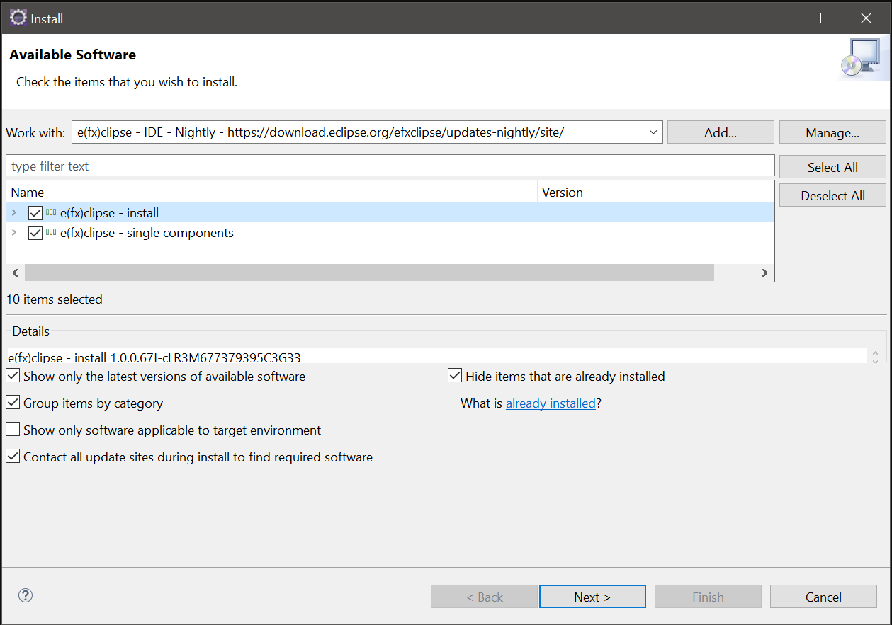

# Seção 18: JAVAFX

## Aula 01 - Configuração do Ambiente:
Vamos preparar o nosso ambiente de desenvolvimento, pois o JavaFX é um recurso que não vem junto com o pacote Java, quando é instalado.

Para isso, vamos precisar baixar as dependências para configurarmos isso no eclipse. Para isso, vamos seguir os seguintes passos

- 1: Acessamos o seguinte site

    https://openjfx.io/

Scrollando para baixo, iremos encontrar a opção para Download. E clicamos nela.

- 2: Vamos baixar a versão LTS, pode pegar a última versão, do pacote, conforme o seu sistema operacional, do tipo SDK. E isso irá baixar um arquivo .zip. Podemos descompactar esse arquivo .zip e recomendamos deixar essa pasta em algum arquivo home, ou application ou Disco local C:, pois iremos realizar um apontamento sobre essa pasta pelo eclipse.

- 3: Note que, acessando a pasta descompactada e acessando o lib, dentro dela, haverá muitos arquivos .jar. Vamos ter que enviar esses arquivos no eclipse.

    No caso, como o meu sistema operacional é Linux, na minha será realizado da seguinte forma no eclipse

        Windows -> Preferences -> Na aba da busca digite "User Lib" -> Selecionamos o "User Libraries" -> New -> Colocamos o nome "JavaFX21" -> Ok -> Add External Jars... -> Vai até a pasta onde foi descompactado e entra até a pasta lib -> Seleciona todos os arquivos .jar -> Ok -> Em "javafx.base.jar" selecionamos o "Source attachment" -> Edit -> External Location -> External file -> Dentro da pasta que foi descompactada, procure pelo "src.zip" -> Ok e, realizamos o mesmo processo para os "Source attachment" restantes. -> Apply and Close

    Bom, agora, temos todas as bibliotecas de JavaFX configurada apontando para a pasta que foi descompactada.

Na próxima aula, vamos criar um projeto e associar esse projeto sobre essa biblioteca JavaFX que conseguimos configurar no eclipse.

## Aula 02 - Configuração do Projeto:
Bom, configurado a nossa biblioteca, Java FX, vamos, agora, criar um novo projeto para implementarmos o Java FX nela.

Vamos criar um novo projeto java "exercicios-javaFx" da seguinte forma

    New -> Java Project -> Porject Name: exercicios-javaFx -> Create module-info.java file, Module name: exerciciosfx -> Finish

Agora, vamos configurar a biblioteca do JavaFX, dentro dela. Então, realizamos o seguinte passo a passo

    Build Path -> Configure Build Path... -> Librarires -> Seleciona "Modulepath" -> Add Library -> User Library -> Next -> JavaFX21 -> Finish -> Apply and Close

Bom, agora, vamos criar um novo pacote chamado "basico" e, dentro desse pacote, criamos uma nova classe "PrimeiroFX". Agora, vamos querer que essa classe herde uma outra classe que não está ainda relacionado com o projeto. Para isso, vamos precisar fazer um requires do "javafx.controls" dentro do arquivo, module-info, da seguinte forma

    module exerciciosfx {
        requires javafx.controls;
    }

Daí, na classe, PrimeiroFX, que acabamos de criar, nela inserimos o seguinte

    package basico;

    import javafx.application.Application;
    import javafx.stage.Stage;

    public class PrimeiroFX extends Application {

        @Override
        public void start(Stage primaryStage) throws Exception {
            // TODO Auto-generated method stub
            
        }
    }

Podemos acessar o código fonte das classes que pegamos de integrações externas colocando a seta do mouse em cima do nome da classe e aparecerá uma opção "Open Declaration". Clicando nela conseguimos acessar como é o código dessa classe.

Agora, vamos realizar a seguinte complementação dentro da classe, PrimeiroFX, da seguinte forma

    package basico;

    import javafx.application.Application;
    import javafx.stage.Stage;

    public class PrimeiroFX extends Application {

        @Override
        public void start(Stage primaryStage) throws Exception {
            // TODO Auto-generated method stub
            primaryStage.show();
        }
        
        public static void main(String[] args) {
            launch(args);
        }
    }

Ao executar o código acima, vamos ver que, no console, será exibido muitos erros relacionado ao reflection.

Para isso, vamos ter que abrir alguns pacotes pelo módulo. Então, realizamos o seguinte

    module exerciciosfx {
        requires javafx.controls;
        
        opens basico;
    }

Feito isso, ao rodarmos, novamente, a classe, PrimeiroFX, vamos ver que, desta vez, ira abrir um modal com a tela tudo em preto, ou em branco para algumas pessoas, dendendo do sistema operacional.

Bom, vamos realizar mais algumas implementações em cima dessa classe. No caso vamos colocar um botão nela da seguinte maneira

    package basico;

    import javafx.application.Application;
    import javafx.scene.Scene;
    import javafx.scene.control.Button;
    import javafx.scene.layout.VBox;
    import javafx.stage.Stage;

    public class PrimeiroFX extends Application {

        @Override
        public void start(Stage primaryStage) throws Exception {
            // TODO Auto-generated method stub
            
            Button botaoA = new Button("A");
            Button botaoB = new Button("B");
            Button botaoC = new Button("C");
            
            VBox box = new VBox();
            box.getChildren().add(botaoA);
            box.getChildren().add(botaoB);
            box.getChildren().add(botaoC);
            
            Scene unicaCena = new Scene(box);
            
            primaryStage.setScene(unicaCena);
            primaryStage.show();
        }
        
        public static void main(String[] args) {
            launch(args);
        }
    }

Ao rodarmos o código acima, vamos ver que irá aparecer uma modal com os três botões, A, B e C configurados.

Vamos melhorar a visualização do layout da seguinte forma

    package basico;

    import javafx.application.Application;
    import javafx.geometry.Pos;
    import javafx.scene.Scene;
    import javafx.scene.control.Button;
    import javafx.scene.layout.VBox;
    import javafx.stage.Stage;

    public class PrimeiroFX extends Application {

        @Override
        public void start(Stage primaryStage) throws Exception {
            // TODO Auto-generated method stub
            
            Button botaoA = new Button("A");
            Button botaoB = new Button("B");
            Button botaoC = new Button("C");
            
            VBox box = new VBox();
            box.setAlignment(Pos.CENTER);
            box.setSpacing(10);
            box.getChildren().add(botaoA);
            box.getChildren().add(botaoB);
            box.getChildren().add(botaoC);
            
            Scene unicaCena = new Scene(box, 200, 400);
            
            primaryStage.setScene(unicaCena);
            primaryStage.show();
        }
        
        public static void main(String[] args) {
            launch(args);
        }
    }

Assim, vamos conseguir obter uma visualização melhorada dos botões A, B e C com mais espaçamento.

Podemos tornar a caiba de forma horizontal, mudando o "VBox" para "HBox" e colocando as escalas de "Scene" para 150 e 100

    package basico;

    import javafx.application.Application;
    import javafx.geometry.Pos;
    import javafx.scene.Scene;
    import javafx.scene.control.Button;
    import javafx.scene.layout.HBox;
    //import javafx.scene.layout.VBox;
    import javafx.stage.Stage;

    public class PrimeiroFX extends Application {

        @Override
        public void start(Stage primaryStage) throws Exception {
            // TODO Auto-generated method stub
            
            Button botaoA = new Button("A");
            Button botaoB = new Button("B");
            Button botaoC = new Button("C");
            
    //		VBox box = new VBox();
            HBox box = new HBox();
            box.setAlignment(Pos.CENTER);
            box.setSpacing(10);
            box.getChildren().add(botaoA);
            box.getChildren().add(botaoB);
            box.getChildren().add(botaoC);
            
    //		Scene unicaCena = new Scene(box, 100, 150);
            Scene unicaCena = new Scene(box, 150, 100);
            
            primaryStage.setScene(unicaCena);
            primaryStage.show();
        }
        
        public static void main(String[] args) {
            launch(args);
        }
    }

Bom, até agora, só colocamos os botões, como se estivessemos realizando uma marcação das tags. Porém, vamos colocar uma ação de cada botão

    package basico;

    import javafx.application.Application;
    import javafx.geometry.Pos;
    import javafx.scene.Scene;
    import javafx.scene.control.Button;
    import javafx.scene.layout.HBox;
    //import javafx.scene.layout.VBox;
    import javafx.stage.Stage;

    public class PrimeiroFX extends Application {

        @Override
        public void start(Stage primaryStage) throws Exception {
            // TODO Auto-generated method stub
            
            Button botaoA = new Button("A");
            Button botaoB = new Button("B");
            Button botaoC = new Button("C");
            
            botaoA.setOnAction(e -> System.out.println("A"));
            botaoB.setOnAction(e -> System.out.println("B"));
            botaoC.setOnAction(e -> System.exit(0));
            
    //		VBox box = new VBox();
            HBox box = new HBox();
            box.setAlignment(Pos.CENTER);
            box.setSpacing(10);
            box.getChildren().add(botaoA);
            box.getChildren().add(botaoB);
            box.getChildren().add(botaoC);
            
    //		Scene unicaCena = new Scene(box, 100, 150);
            Scene unicaCena = new Scene(box, 150, 100);
            
            primaryStage.setScene(unicaCena);
            primaryStage.show();
        }
        
        public static void main(String[] args) {
            launch(args);
        }
    }

No caso, com as ações definidas para os botões acima, conseguimos ver que para o botão A e B, será printado os alfabeto A e B no console e, o botão C, irá fechar a tela, saindo da aplicação.

## Aula 03 - Contador #01:
Vamos, agora, realizar o nosso segundo exercícios de contagem.

Bom, o exercício em sí será algo bem simples, visto que iremos criar um botão e em cima disso configurar o processo de contagem. Vamos conhecer os estilos do Java FX que difere, para quem já conhece outros framworks voltados para o Front-End que tem como base JavaScript, de muitos outros estilos de frameworks voltados para front-end.

bom, por começo, dentro do pacote, basico, vamos criar uma classe, Contador, e nela inserimos o seguinte

    package basico;

    import javafx.application.Application;
    import javafx.scene.Scene;
    import javafx.scene.control.Button;
    import javafx.scene.control.Label;
    import javafx.scene.layout.VBox;
    import javafx.stage.Stage;

    public class Contador extends Application {

        @Override
        public void start(Stage primaryStage) throws Exception {
            // TODO Auto-generated method stub
            
            Label labelTitulo = new Label("Contador");
            Label labelNumero = new Label("0");
            
            Button botaoDecremento = new Button("-");
            Button botaoIncremento = new Button("+");
            
            VBox boxPrincipal = new VBox();
            boxPrincipal.getChildren().add(labelTitulo);
            boxPrincipal.getChildren().add(labelNumero);
            boxPrincipal.getChildren().add(botaoDecremento);
            boxPrincipal.getChildren().add(botaoIncremento);
            
            Scene cenaPrincipal = new Scene(boxPrincipal);
            
            primaryStage.setScene(cenaPrincipal);
            primaryStage.show();
        }
        
        public static void main(String[] args) {
            launch(args);
        }
    }

Bom, vamos ver como o layout ficou configurado rodando o código acima. Vemos que os elementos que queremos acionar estão todas elas contido, porém, bem apertados.

Vamos, agora, ajustar os tamanhos e os espaçamentos da seguinte forma

    package basico;

    import javafx.application.Application;
    import javafx.scene.Scene;
    import javafx.scene.control.Button;
    import javafx.scene.control.Label;
    import javafx.scene.layout.HBox;
    import javafx.scene.layout.VBox;
    import javafx.stage.Stage;

    public class Contador extends Application {

        @Override
        public void start(Stage primaryStage) throws Exception {
            // TODO Auto-generated method stub
            
            Label labelTitulo = new Label("Contador");
            Label labelNumero = new Label("0");
            
            Button botaoDecremento = new Button("-");
            Button botaoIncremento = new Button("+");
            
            HBox boxBotoes = new HBox();
            boxBotoes.getChildren().add(botaoDecremento);
            boxBotoes.getChildren().add(botaoIncremento);
            
            VBox boxPrincipal = new VBox();
            boxPrincipal.getChildren().add(labelTitulo);
            boxPrincipal.getChildren().add(labelNumero);
            boxPrincipal.getChildren().add(boxBotoes);
            
            Scene cenaPrincipal = new Scene(boxPrincipal, 400, 400);
            
            primaryStage.setScene(cenaPrincipal);
            primaryStage.show();
        }
        
        public static void main(String[] args) {
            launch(args);
        }
    }

Bom, ao rodarmos o código acima, veremos que o tamanho da aplicação e os espaçamentos melhoraram.

Vamos dar mais alguns retoques de melhorias

    package basico;

    import javafx.application.Application;
    import javafx.geometry.Pos;
    import javafx.scene.Scene;
    import javafx.scene.control.Button;
    import javafx.scene.control.Label;
    import javafx.scene.layout.HBox;
    import javafx.scene.layout.VBox;
    import javafx.stage.Stage;

    public class Contador extends Application {

        @Override
        public void start(Stage primaryStage) throws Exception {
            // TODO Auto-generated method stub
            
            Label labelTitulo = new Label("Contador");
            Label labelNumero = new Label("0");
            
            Button botaoDecremento = new Button("-");
            Button botaoIncremento = new Button("+");
            
            HBox boxBotoes = new HBox();
            boxBotoes.setAlignment(Pos.CENTER);
            boxBotoes.setSpacing(10);
            boxBotoes.getChildren().add(botaoDecremento);
            boxBotoes.getChildren().add(botaoIncremento);
            
            VBox boxPrincipal = new VBox();
            boxPrincipal.setAlignment(Pos.CENTER);
            boxPrincipal.setSpacing(10);
            boxPrincipal.getChildren().add(labelTitulo);
            boxPrincipal.getChildren().add(labelNumero);
            boxPrincipal.getChildren().add(boxBotoes);
            
            Scene cenaPrincipal = new Scene(boxPrincipal, 400, 400);
            
            primaryStage.setScene(cenaPrincipal);
            primaryStage.show();
        }
        
        public static void main(String[] args) {
            launch(args);
        }
    }

Bom, rodando, agora, o código acima, vamos ver que o layout melhorou. Claro, no sentido de configurarmos algo bem básico.

Do ponto de vista de layout, ainda temos muitas implementações que podemos realizar para melhorar o visual, porém, na próxima aula, iremos focar, primeiro, no âmbito da funcionalidade dos botões para depois nos preocuparmos com a qualidade visual da aplicação.

## Aula 04 - Contador #02:
Vamos, agora, implementar sobre os botões as funcionalidades de contagens.

Bom, na classe, Contador, do pacote, basico, vamos aplicar as ações sobre os botões que definimos, da seguinte forma

    package basico;

    import javafx.application.Application;
    import javafx.geometry.Pos;
    import javafx.scene.Scene;
    import javafx.scene.control.Button;
    import javafx.scene.control.Label;
    import javafx.scene.layout.HBox;
    import javafx.scene.layout.VBox;
    import javafx.stage.Stage;

    public class Contador extends Application {
        
        private int contador = 0;

        @Override
        public void start(Stage primaryStage) throws Exception {
            // TODO Auto-generated method stub
            
            Label labelTitulo = new Label("Contador");
            Label labelNumero = new Label("0");
            
            Button botaoDecremento = new Button("-");
            botaoDecremento.setOnAction(e -> {
                contador--;
                labelNumero.setText(Integer.toString(contador));
            });
            
            Button botaoIncremento = new Button("+");
            botaoIncremento.setOnAction(e -> {
                contador++;
                labelNumero.setText(Integer.toString(contador));
            });
            
            HBox boxBotoes = new HBox();
            boxBotoes.setAlignment(Pos.CENTER);
            boxBotoes.setSpacing(10);
            boxBotoes.getChildren().add(botaoDecremento);
            boxBotoes.getChildren().add(botaoIncremento);
            
            VBox boxPrincipal = new VBox();
            boxPrincipal.setAlignment(Pos.CENTER);
            boxPrincipal.setSpacing(10);
            boxPrincipal.getChildren().add(labelTitulo);
            boxPrincipal.getChildren().add(labelNumero);
            boxPrincipal.getChildren().add(boxBotoes);
            
            Scene cenaPrincipal = new Scene(boxPrincipal, 400, 400);
            
            primaryStage.setScene(cenaPrincipal);
            primaryStage.show();
        }
        
        public static void main(String[] args) {
            launch(args);
        }
    }

Executando o código acima, agora, vamos ver que a cada click que realizamos sobre os botões de incremento e decremento, vamos conseguir acrescentar e subtrair de um em um.

## Aula 05 - Contador #03:
Vamos, agora, focar na parte melhoria da qualidade visual do Contador.

Para isso, iremos utilizar os recursos de CSS.

Vamos, então, criar um novo arquivo fazendo o seguinte passo a passo

    sobre o pacote "basico" clicamos com o botão direito -> New -> File -> File name: Contador.css -> Finish

Dentro desse arquivo .css, vamos inserir o seguinte

    .conteudo {
        -fx-background-color: red; 
    }

Como um começo, definimos o plano de fundo na cor vermelha para ficar nítido que foi implementado com sucesso o css.

Agora, vamos mostrar como conseguimos considerar esse arquivo css dentro da nossa classe, Contador, do pacote, basico

    package basico;

    import javafx.application.Application;
    import javafx.geometry.Pos;
    import javafx.scene.Scene;
    import javafx.scene.control.Button;
    import javafx.scene.control.Label;
    import javafx.scene.layout.HBox;
    import javafx.scene.layout.VBox;
    import javafx.stage.Stage;

    public class Contador extends Application {
        
        private int contador = 0;

        @Override
        public void start(Stage primaryStage) throws Exception {
            // TODO Auto-generated method stub
            
            Label labelTitulo = new Label("Contador");
            Label labelNumero = new Label("0");
            
            Button botaoDecremento = new Button("-");
            botaoDecremento.setOnAction(e -> {
                contador--;
                labelNumero.setText(Integer.toString(contador));
            });
            
            Button botaoIncremento = new Button("+");
            botaoIncremento.setOnAction(e -> {
                contador++;
                labelNumero.setText(Integer.toString(contador));
            });
            
            HBox boxBotoes = new HBox();
            boxBotoes.setAlignment(Pos.CENTER);
            boxBotoes.setSpacing(10);
            boxBotoes.getChildren().add(botaoDecremento);
            boxBotoes.getChildren().add(botaoIncremento);
            
            VBox boxPrincipal = new VBox();
            boxPrincipal.setAlignment(Pos.CENTER);
            boxPrincipal.setSpacing(10);
            boxPrincipal.getChildren().add(labelTitulo);
            boxPrincipal.getChildren().add(labelNumero);
            boxPrincipal.getChildren().add(boxBotoes);
            
            String caminhoDoCss = getClass()
                    .getResource("/basico/Contador.css")
                    .toExternalForm();
            
            Scene cenaPrincipal = new Scene(boxPrincipal, 400, 400);
            cenaPrincipal.getStylesheets().add(caminhoDoCss);
            
            primaryStage.setScene(cenaPrincipal);
            primaryStage.show();
        }
        
        public static void main(String[] args) {
            launch(args);
        }
    }

No caso, utilizamos o getStylesheets e nela definimos um caminho onde se encontra o arquivo "Contador.css" para verificarmos se a classe está conseguindo identificar esse arquivo .css. Ao executarmos o código acima, se não tivemos nenhum problema e o modal apareceu normalmente, então significa que o arquivo foi identificado de foma bem sucedida.

Porém, note que, a customização da cor que colocamos dentro do arquivo, Contador.css, não foi considerado, pois o processo acima, só funcionou para identificarmos o arquivo. Agora, falta, conseguirmos aplicar o que foi configurado dentro do arquivo .css. No caso, realizamos o seguinte

    package basico;

    import javafx.application.Application;
    import javafx.geometry.Pos;
    import javafx.scene.Scene;
    import javafx.scene.control.Button;
    import javafx.scene.control.Label;
    import javafx.scene.layout.HBox;
    import javafx.scene.layout.VBox;
    import javafx.stage.Stage;

    public class Contador extends Application {
        
        private int contador = 0;

        @Override
        public void start(Stage primaryStage) throws Exception {
            // TODO Auto-generated method stub
            
            Label labelTitulo = new Label("Contador");
            Label labelNumero = new Label("0");
            
            Button botaoDecremento = new Button("-");
            botaoDecremento.setOnAction(e -> {
                contador--;
                labelNumero.setText(Integer.toString(contador));
            });
            
            Button botaoIncremento = new Button("+");
            botaoIncremento.setOnAction(e -> {
                contador++;
                labelNumero.setText(Integer.toString(contador));
            });
            
            HBox boxBotoes = new HBox();
            boxBotoes.setAlignment(Pos.CENTER);
            boxBotoes.setSpacing(10);
            boxBotoes.getChildren().add(botaoDecremento);
            boxBotoes.getChildren().add(botaoIncremento);
            
            VBox boxConteudo = new VBox();
            boxConteudo.getStyleClass().add("conteudo");
            boxConteudo.setAlignment(Pos.CENTER);
            boxConteudo.setSpacing(10);
            boxConteudo.getChildren().add(labelTitulo);
            boxConteudo.getChildren().add(labelNumero);
            boxConteudo.getChildren().add(boxBotoes);
            
            String caminhoDoCss = getClass()
                    .getResource("/basico/Contador.css")
                    .toExternalForm();
            
            Scene cenaPrincipal = new Scene(boxConteudo, 400, 400);
            cenaPrincipal.getStylesheets().add(caminhoDoCss);
            
            primaryStage.setScene(cenaPrincipal);
            primaryStage.show();
        }
        
        public static void main(String[] args) {
            launch(args);
        }
    }

No caso, no boxConteudo, aplicamos o getStyleClass, e colocamos o nome do css que definimos a customização que queremos. Rodando o código acima, vamos ver que teremos a cor vermelha de fundo na aplicação, como havíamos definido. Mas queremos que a cor do fundo seja preto, então mudamos o nome de "red" para "black", no arquivo, Contador.css.

Bom, além da cor de fundo, vamos precisar definir as fontes para isso tbm. No caso, existe uma fonte que é muito útil para tais finalidades de layout de páginas

    https://fonts.google.com/

Nela, conseguimos escolher as fontes e pegar o código css que nos permite aplicar a tal fonte. No caso, por exemplo peguei a seguinte fonte

    https://fonts.googleapis.com/css2?family=Smooch+Sans:wght@100..900&display=swap

Então, para aplicarmos essa fonte, podemos realizar o seguinte na classe, Contador, inserindo

    package basico;

    import javafx.application.Application;
    import javafx.geometry.Pos;
    import javafx.scene.Scene;
    import javafx.scene.control.Button;
    import javafx.scene.control.Label;
    import javafx.scene.layout.HBox;
    import javafx.scene.layout.VBox;
    import javafx.stage.Stage;

    public class Contador extends Application {
        
        private int contador = 0;

        @Override
        public void start(Stage primaryStage) throws Exception {
            // TODO Auto-generated method stub
            
            Label labelTitulo = new Label("Contador");
            Label labelNumero = new Label("0");
            
            Button botaoDecremento = new Button("-");
            botaoDecremento.setOnAction(e -> {
                contador--;
                labelNumero.setText(Integer.toString(contador));
            });
            
            Button botaoIncremento = new Button("+");
            botaoIncremento.setOnAction(e -> {
                contador++;
                labelNumero.setText(Integer.toString(contador));
            });
            
            HBox boxBotoes = new HBox();
            boxBotoes.setAlignment(Pos.CENTER);
            boxBotoes.setSpacing(10);
            boxBotoes.getChildren().add(botaoDecremento);
            boxBotoes.getChildren().add(botaoIncremento);
            
            VBox boxConteudo = new VBox();
            boxConteudo.getStyleClass().add("conteudo");
            boxConteudo.setAlignment(Pos.CENTER);
            boxConteudo.setSpacing(10);
            boxConteudo.getChildren().add(labelTitulo);
            boxConteudo.getChildren().add(labelNumero);
            boxConteudo.getChildren().add(boxBotoes);
            
            String caminhoDoCss = getClass()
                    .getResource("/basico/Contador.css")
                    .toExternalForm();
            
            Scene cenaPrincipal = new Scene(boxConteudo, 400, 400);
            cenaPrincipal.getStylesheets().add(caminhoDoCss);
            cenaPrincipal.getStylesheets().add("https://fonts.googleapis.com/css2?family=Smooch+Sans:wght@100..900&display=swap");
            
            primaryStage.setScene(cenaPrincipal);
            primaryStage.show();
        }
        
        public static void main(String[] args) {
            launch(args);
        }
    }

No caso, ao compilarmos o programa, ela irá buscar, usando a internet, essa fonte para ser aplicado.

Mas, claro, uma boa prática seria que a tal personalização seja configurado dentro do arquivo .css, do que depender da internet. No caso, no arquivo, Contador.css, podemos realizar a seguinte customização

    .conteudo {
        -fx-background-color: #000;
    }

    .numero {
        -fx-font-family: Oswald;
        -fx-text-fill: #fff;
    }

Agora, falta, aplicarmos tais fontes da seguinte forma

    package basico;

    import javafx.application.Application;
    import javafx.geometry.Pos;
    import javafx.scene.Scene;
    import javafx.scene.control.Button;
    import javafx.scene.control.Label;
    import javafx.scene.layout.HBox;
    import javafx.scene.layout.VBox;
    import javafx.stage.Stage;

    public class Contador extends Application {
        
        private int contador = 0;

        @Override
        public void start(Stage primaryStage) throws Exception {
            // TODO Auto-generated method stub
            
            Label labelTitulo = new Label("Contador");
            labelTitulo.getStyleClass().add("numero");
            
            Label labelNumero = new Label("0");
            labelNumero.getStyleClass().add("numero");
            
            Button botaoDecremento = new Button("-");
            botaoDecremento.setOnAction(e -> {
                contador--;
                labelNumero.setText(Integer.toString(contador));
            });
            
            Button botaoIncremento = new Button("+");
            botaoIncremento.setOnAction(e -> {
                contador++;
                labelNumero.setText(Integer.toString(contador));
            });
            
            HBox boxBotoes = new HBox();
            boxBotoes.setAlignment(Pos.CENTER);
            boxBotoes.setSpacing(10);
            boxBotoes.getChildren().add(botaoDecremento);
            boxBotoes.getChildren().add(botaoIncremento);
            
            VBox boxConteudo = new VBox();
            boxConteudo.getStyleClass().add("conteudo");
            boxConteudo.setAlignment(Pos.CENTER);
            boxConteudo.setSpacing(10);
            boxConteudo.getChildren().add(labelTitulo);
            boxConteudo.getChildren().add(labelNumero);
            boxConteudo.getChildren().add(boxBotoes);
            
            String caminhoDoCss = getClass()
                    .getResource("/basico/Contador.css")
                    .toExternalForm();
            
            Scene cenaPrincipal = new Scene(boxConteudo, 400, 400);
            cenaPrincipal.getStylesheets().add(caminhoDoCss);
            
            primaryStage.setScene(cenaPrincipal);
            primaryStage.show();
        }
        
        public static void main(String[] args) {
            launch(args);
        }
    }

Rodando o código acima, vamos ver que o css, numero, que definimos pegou no título e no valor da contagem.

Podemos, claro, manipular, o tamanho da fonte tbm, colocando o seguinte no css, numero, que foi definido

    .conteudo {
        -fx-background-color: #000;
    }

    .numero {
        -fx-font-family: Oswald;
        -fx-text-fill: #fff;
        -fx-font-size: 22px;
    }

Vamos criar uma outra classe css para título da seguinte forma

    .conteudo {
        -fx-background-color: #000;
        -fx-font-family: Oswald;
    }

    .titulo {
        -fx-text-fill: #48b2ee;
        -fx-font-size: 32px;
    }

    .numero {
        -fx-text-fill: #fff;
        -fx-font-size: 22px;
    }

Aplicando, na classe, Contador.java, da seguinte forma

    package basico;

    import javafx.application.Application;
    import javafx.geometry.Pos;
    import javafx.scene.Scene;
    import javafx.scene.control.Button;
    import javafx.scene.control.Label;
    import javafx.scene.layout.HBox;
    import javafx.scene.layout.VBox;
    import javafx.stage.Stage;

    public class Contador extends Application {
        
        private int contador = 0;

        @Override
        public void start(Stage primaryStage) throws Exception {
            // TODO Auto-generated method stub
            
            Label labelTitulo = new Label("Contador");
            labelTitulo.getStyleClass().add("titulo");
            
            Label labelNumero = new Label("0");
            labelNumero.getStyleClass().add("numero");
            
            Button botaoDecremento = new Button("-");
            botaoDecremento.setOnAction(e -> {
                contador--;
                labelNumero.setText(Integer.toString(contador));
            });
            
            Button botaoIncremento = new Button("+");
            botaoIncremento.setOnAction(e -> {
                contador++;
                labelNumero.setText(Integer.toString(contador));
            });
            
            HBox boxBotoes = new HBox();
            boxBotoes.setAlignment(Pos.CENTER);
            boxBotoes.setSpacing(10);
            boxBotoes.getChildren().add(botaoDecremento);
            boxBotoes.getChildren().add(botaoIncremento);
            
            VBox boxConteudo = new VBox();
            boxConteudo.getStyleClass().add("conteudo");
            boxConteudo.setAlignment(Pos.CENTER);
            boxConteudo.setSpacing(10);
            boxConteudo.getChildren().add(labelTitulo);
            boxConteudo.getChildren().add(labelNumero);
            boxConteudo.getChildren().add(boxBotoes);
            
            String caminhoDoCss = getClass()
                    .getResource("/basico/Contador.css")
                    .toExternalForm();
            
            Scene cenaPrincipal = new Scene(boxConteudo, 400, 400);
            cenaPrincipal.getStylesheets().add(caminhoDoCss);
            
            primaryStage.setScene(cenaPrincipal);
            primaryStage.show();
        }
        
        public static void main(String[] args) {
            launch(args);
        }
    }

Rodando o código acima, vamos ver que as customizações que foi definida no arquivo, Contador.css, surtiu efeito.

## Aula 06 - Contador #04:
Vamos, agora, agora dinamizar os estilos.

Ou seja, iremos utilizar as condicionais de forma a definir que tipo de customização seja atribuida para aquela classe de acordo com o tipo de resulado que tivermos nas ações dos botões.

No caso, no arquivo, Contador.css, iremos complementar com a seguinte classe para personalizarmos os botões

    .conteudo {
        -fx-background-color: #000;
        -fx-font-family: Oswald;
    }

    .titulo {
        -fx-text-fill: #48b2ee;
        -fx-font-size: 32px;
    }

    .numero {
        -fx-text-fill: #fff;
        -fx-font-size: 22px;
    }

    .botoes {
        -fx-background-color: #fff;
        -fx-text-fill: #48b2ee;
        -fx-font-size: 24px;
        -fx-min-width: 60px;
        -fx-min-height: 60px;
        -fx-background-radius: 30px;
    }

Agora, implementamos essa classe css, botoes, na nossa classe, Contador.java, da seguinte forma

    package basico;

    import javafx.application.Application;
    import javafx.geometry.Pos;
    import javafx.scene.Scene;
    import javafx.scene.control.Button;
    import javafx.scene.control.Label;
    import javafx.scene.layout.HBox;
    import javafx.scene.layout.VBox;
    import javafx.stage.Stage;

    public class Contador extends Application {
        
        private int contador = 0;

        @Override
        public void start(Stage primaryStage) throws Exception {
            // TODO Auto-generated method stub
            
            Label labelTitulo = new Label("Contador");
            labelTitulo.getStyleClass().add("titulo");
            
            Label labelNumero = new Label("0");
            labelNumero.getStyleClass().add("numero");
            
            Button botaoDecremento = new Button("-");
            botaoDecremento.getStyleClass().add("botoes");
            botaoDecremento.setOnAction(e -> {
                contador--;
                labelNumero.setText(Integer.toString(contador));
            });
            
            Button botaoIncremento = new Button("+");
            botaoIncremento.getStyleClass().add("botoes");
            botaoIncremento.setOnAction(e -> {
                contador++;
                labelNumero.setText(Integer.toString(contador));
            });
            
            HBox boxBotoes = new HBox();
            boxBotoes.setAlignment(Pos.CENTER);
            boxBotoes.setSpacing(10);
            boxBotoes.getChildren().add(botaoDecremento);
            boxBotoes.getChildren().add(botaoIncremento);
            
            VBox boxConteudo = new VBox();
            boxConteudo.getStyleClass().add("conteudo");
            boxConteudo.setAlignment(Pos.CENTER);
            boxConteudo.setSpacing(10);
            boxConteudo.getChildren().add(labelTitulo);
            boxConteudo.getChildren().add(labelNumero);
            boxConteudo.getChildren().add(boxBotoes);
            
            String caminhoDoCss = getClass()
                    .getResource("/basico/Contador.css")
                    .toExternalForm();
            
            Scene cenaPrincipal = new Scene(boxConteudo, 400, 400);
            cenaPrincipal.getStylesheets().add(caminhoDoCss);
            
            primaryStage.setScene(cenaPrincipal);
            primaryStage.show();
        }
        
        public static void main(String[] args) {
            launch(args);
        }
    }

Rodando o código acima, vamos ver que conseguimos realizar customizações sobre os dois botões.

Agora, falta, implementarmos uma customização condicional, mas deixarei isso como um desafio onde irei colocar a resposta na próxima aula.

Basicamente, quando a contagem do número for negativo, queremos que a cor do número fique vermelho e, quando a contagem for positiva, que fique verde. Além disso, se for zero, que não seja nenhuma das cores acima, e que seja a cor original.

## Aula 07 - Contador #05:
Vamos resolver o desafio de colocar condicional nas personalizações de cada cores.

Bom, basta seguir a resolução que fiz seguinte

    package basico;

    import javafx.application.Application;
    import javafx.geometry.Pos;
    import javafx.scene.Scene;
    import javafx.scene.control.Button;
    import javafx.scene.control.Label;
    import javafx.scene.layout.HBox;
    import javafx.scene.layout.VBox;
    import javafx.stage.Stage;

    public class Contador extends Application {
        
        private int contador = 0;
        
        private void changeColor(Button btn, Label label) {
            label.getStyleClass().remove("verde");
            label.getStyleClass().remove("vermelha");
            
            if(contador < 0) {
                label.getStyleClass().add("vermelha");
            } else if(contador > 0) {
                label.getStyleClass().add("verde");
            }
            label.setText(Integer.toString(contador));
        }

        @Override
        public void start(Stage primaryStage) throws Exception {
            // TODO Auto-generated method stub
            
            Label labelTitulo = new Label("Contador");
            labelTitulo.getStyleClass().add("titulo");
            
            Label labelNumero = new Label("0");
            labelNumero.getStyleClass().add("numero");
            
            Button botaoDecremento = new Button("-");
            botaoDecremento.getStyleClass().add("botoes");
            botaoDecremento.setOnAction(e -> {
                contador--;
                changeColor(botaoDecremento, labelNumero);
            });
            
            Button botaoIncremento = new Button("+");
            botaoIncremento.getStyleClass().add("botoes");
            botaoIncremento.setOnAction(e -> {
                contador++;
                changeColor(botaoIncremento, labelNumero);
            });
            
            HBox boxBotoes = new HBox();
            boxBotoes.setAlignment(Pos.CENTER);
            boxBotoes.setSpacing(10);
            boxBotoes.getChildren().add(botaoDecremento);
            boxBotoes.getChildren().add(botaoIncremento);
            
            VBox boxConteudo = new VBox();
            boxConteudo.getStyleClass().add("conteudo");
            boxConteudo.setAlignment(Pos.CENTER);
            boxConteudo.setSpacing(10);
            boxConteudo.getChildren().add(labelTitulo);
            boxConteudo.getChildren().add(labelNumero);
            boxConteudo.getChildren().add(boxBotoes);
            
            String caminhoDoCss = getClass()
                    .getResource("/basico/Contador.css")
                    .toExternalForm();
            
            Scene cenaPrincipal = new Scene(boxConteudo, 400, 400);
            cenaPrincipal.getStylesheets().add(caminhoDoCss);
            
            primaryStage.setScene(cenaPrincipal);
            primaryStage.show();
        }
        
        public static void main(String[] args) {
            launch(args);
        }
    }

Obs: Durante a resolução desse problema, percebi que existe uma hierarquia entre cores. Ou seja, se num Label, estiver adicionado duas cores diferentes, será considerado aquela cor com a maior hierarquia. Por isso a necessidade de remover todas as classes de cores primeiro, para depois acrescentar.

## Aula 08 - Trocando Scenes - Alternando Telas:
Vamos, agora, realizar um estudo de troca de telas. Ou seja, bom base de alguma ação, ocorre uma troca de tela da aplicação.

Por começo, no pacote, basico, vamos criar uma classe chamado "Wizard" e ne la inserimos o seguinte

    package basico;

    import javafx.application.Application;
    import javafx.stage.Stage;

    public class Wizard extends Application {

        @Override
        public void start(Stage primaryStage) throws Exception {
            // TODO Auto-generated method stub
            primaryStage.show();
        }
        
        public static void main(String[] args) {
            launch(args);
        }
    }

Bom, em seguida complementamos com o seguinte código

    package basico;

    import javafx.application.Application;
    import javafx.geometry.Pos;
    import javafx.scene.Scene;
    import javafx.scene.control.Button;
    import javafx.scene.layout.HBox;
    import javafx.stage.Stage;

    public class Wizard extends Application {
        
        private Stage janela;
        private Scene passo1;
        private Scene passo2;
        private Scene passo3;

        @Override
        public void start(Stage primaryStage) throws Exception {
            // TODO Auto-generated method stub
            
            janela = primaryStage;
            
            criarPasso1();
            
            primaryStage.setScene(passo1);
            primaryStage.setTitle("Wizard");
            primaryStage.show();
        }
        
        private void criarPasso1() {
            Button proximoPasso = new Button("Ir p/ Passo 2 >>");
            
            HBox box = new HBox();
            box.setAlignment(Pos.CENTER);
            box.getChildren().add(proximoPasso);
            
            passo1 = new Scene(box, 400, 400);
        }
        
        public static void main(String[] args) {
            launch(args);
        }
    }

Rodando o código acima, se nada estiver errado, irá aparecer um modal com o botão "Ir p/ Passo 2 >>", da forma como definimos acima.

Visto que a situação acima está funcionando, vamos repetir um processo análogo para os passos adiante

    package basico;

    import javafx.application.Application;
    import javafx.geometry.Pos;
    import javafx.scene.Scene;
    import javafx.scene.control.Button;
    import javafx.scene.layout.HBox;
    import javafx.stage.Stage;

    public class Wizard extends Application {
        
        private Stage janela;
        private Scene passo1;
        private Scene passo2;
        private Scene passo3;

        @Override
        public void start(Stage primaryStage) throws Exception {
            // TODO Auto-generated method stub
            
            janela = primaryStage;
            
            criarPasso1();
            criarPasso2();
            
            janela.setScene(passo1);
            janela.setTitle("Wizard");
            janela.show();
        }
        
        private void criarPasso1() {
            Button proximoPasso = new Button("Ir p/ Passo 2 >>");
            proximoPasso.setOnAction( e -> {
                janela.setScene(passo2);
            });
            
            HBox box = new HBox();
            box.setAlignment(Pos.CENTER);
            box.getChildren().add(proximoPasso);
            
            passo1 = new Scene(box, 400, 400);
        }
        
        private void criarPasso2() {
            Button passoAnterior = new Button("<< Voltar p/ Passo 1");
            Button proximoPasso = new Button("Ir p/ Passo 3 >>");
            
            HBox box = new HBox();
            box.setAlignment(Pos.CENTER);
            box.getChildren().add(passoAnterior);
            box.getChildren().add(proximoPasso);
            
            passo2 = new Scene(box, 400, 400);
        }
        
        public static void main(String[] args) {
            launch(args);
        }
    }

Rodando o código acima, se nada estiver errado, clicando no botão "Ir p/ Passo 2>>" vamos conseguir ir para a outra janela onde haverá dois botões "<< Voltar p/ Passo 1" e "Ir p/ Passo 3 >>". No caso, configuramos uma ação sobre o botão "Ir p/ Passo 2". Vamos realizar a mesma coisa para os outros botões para coneguirmos controlar a ida e a volta da janela.

    package basico;

    import javafx.application.Application;
    import javafx.geometry.Pos;
    import javafx.scene.Scene;
    import javafx.scene.control.Button;
    import javafx.scene.layout.HBox;
    import javafx.stage.Stage;

    public class Wizard extends Application {
        
        private Stage janela;
        private Scene passo1;
        private Scene passo2;
        private Scene passo3;

        @Override
        public void start(Stage primaryStage) throws Exception {
            // TODO Auto-generated method stub
            
            janela = primaryStage;
            
            criarPasso1();
            criarPasso2();
            criarPasso3();
            
            janela.setScene(passo1);
            janela.setTitle("Wizard :: Passo 01");
            janela.show();
        }
        
        private void criarPasso1() {
            Button proximoPasso = new Button("Ir p/ Passo 2 >>");
            proximoPasso.setOnAction( e -> {
                janela.setScene(passo2);
                janela.setTitle("Wizard :: Passo 02");
            });
            
            HBox box = new HBox();
            box.setAlignment(Pos.CENTER);
            box.getChildren().add(proximoPasso);
            
            passo1 = new Scene(box, 400, 400);
        }
        
        private void criarPasso2() {
            Button passoAnterior = new Button("<< Voltar p/ Passo 1");
            passoAnterior.setOnAction( e -> {
                janela.setScene(passo1);
                janela.setTitle("Wizard :: Passo 01");
            });
            
            Button proximoPasso = new Button("Ir p/ Passo 3 >>");
            proximoPasso.setOnAction(e -> {
                janela.setScene(passo3);
                janela.setTitle("Wizard :: Passo 03");
            });
            
            HBox box = new HBox();
            box.setAlignment(Pos.CENTER);
            box.getChildren().add(passoAnterior);
            box.getChildren().add(proximoPasso);
            
            passo2 = new Scene(box, 400, 400);
        }
        
        private void criarPasso3() {
            Button passoAnterior = new Button("<< Voltar p/ Passo 2");
            passoAnterior.setOnAction( e -> {
                janela.setScene(passo2);
                janela.setTitle("Wizard :: Passo 02");
            });
            
            Button proximoPasso = new Button("Finalizar!");
            proximoPasso.setOnAction(e -> {
                System.exit(0);
            });
            
            HBox box = new HBox();
            box.setAlignment(Pos.CENTER);
            box.getChildren().add(passoAnterior);
            box.getChildren().add(proximoPasso);
            
            passo3 = new Scene(box, 400, 400);
        }
        
        public static void main(String[] args) {
            launch(args);
        }
    }

Rodando o código acima, vamos conseguir, agora, alternar entre as telas e na tela que estiver escrito, Passo 03, no título, teremos o botão "Finalizar!" para conseguirmos fechar a aplicação.

## Aula 09 - Gerenciadores de Layout:
Bom, uma das coisas que vc precisa prestar atenção quando se trabalha com alguma biblioteca que esteja relacionada à interfaces gráficas é entender como o Layout ela é aplicado dentro dessa tecnologia, pois isso tem total relação com a forma como vc organizará os componentes visuais na tela.

No caso, o Java FX, existe uma séria de gerenciadores de Layout que te ajudarão a construir as suas interfaces gráficas e é exatamente sobre isso que iremos trabalhar nessa aula.

Vamos criar um novo pacote "layout" e, dentro dele, criamos uma nova classe chamado "AppLayout".

No módulo do desse projeto, vamos precisar tornar esse pacote aberto para nos permitir realizar a reflection. Então, realizamos o seguinte

    module exerciciosfx {
        requires javafx.controls;
        
        opens basico;
        opens layout;
    }

Agora, na classe, AppLayout, coom começo, vamos realizar a seguinte inserção

    package layout;

    import javafx.application.Application;
    import javafx.stage.Stage;

    public class AppLayout extends Application {

        @Override
        public void start(Stage primaryStage) throws Exception {
            // TODO Auto-generated method stub
            primaryStage.setTitle("Gerenciadores de Layout");
            primaryStage.show();
        }
        
        public static void main(String[] args) {
            launch(args);
        }
    }

A situação acima, no caso, tem como o passo inicial para verificarmos se modal está aparecendo de forma correta.

Vamos criar duas classes, agora, no mesmo pacote, donde usaremos para nos facilitar na visualização dos gerenciadores de Layouts. Criamos então as classes "Quadrado" e "Caixa".

Na classe, Quadrado, vamos herdar a classe "Rectangle", uma dos gerenciadores de Layout, do Java Fx da seguinte forma

    package layout;

    import javafx.scene.shape.Rectangle;

    public class Quadrado extends Rectangle {

    }

E na classe, Caixa, vamos herdar a classe "HBox", um dos gerenciadores de Layout, do Java FX da seguinte forma

    package layout;

    import javafx.scene.layout.HBox;

    public class Caixa extends HBox {

    }

Agora, na classe, Caixa, vamos construir os construtores padrões, bom, fazer uns preparativos, da seguinte forma

    package layout;

    import javafx.geometry.Insets;
    import javafx.geometry.Pos;
    import javafx.scene.control.Label;
    import javafx.scene.layout.Background;
    import javafx.scene.layout.BackgroundFill;
    import javafx.scene.layout.CornerRadii;
    import javafx.scene.layout.HBox;
    import javafx.scene.paint.Color;

    public class Caixa extends HBox {
        
        private static int i = 0;
        
        private String[] cores = {
            "#c33c5e", "#39aac6", "#28d79a",
            "#fb750e", "#6657a8", "#f9060e"
        };

        public Caixa() {
            // Definimos as larguras e alturas de forma padrão
            this(100, 100);
        }
        
        public Caixa(int largura, int altura) {
            setAlignment(Pos.CENTER);
            
            setMinWidth(largura);
            setMinHeight(altura);
            
            BackgroundFill fill = new BackgroundFill(Color.web(cores[i]), CornerRadii.EMPTY, Insets.EMPTY);
            setBackground(new Background(fill));
            
            i++;
            if(i == 6) i = 0;
        }
        
        public Caixa comTexto(String texto) {
            Label label = new Label(texto);
            getChildren().add(label);
            return this;
        }
    }

Agora, na classe, AppLayout, vamos realizar a seguinte implementação

    package layout;

    import javafx.application.Application;
    import javafx.scene.Scene;
    import javafx.scene.layout.VBox;
    import javafx.stage.Stage;

    public class AppLayout extends Application {

        @Override
        public void start(Stage primaryStage) throws Exception {
            // TODO Auto-generated method stub
            
            VBox temp = new VBox();
            temp.getChildren().add(new Caixa().comTexto("1"));
            temp.getChildren().add(new Caixa().comTexto("2"));
            temp.getChildren().add(new Caixa().comTexto("3"));
            temp.getChildren().add(new Caixa().comTexto("4"));
            
            Scene principal = new Scene(temp, 800, 600);
            
            primaryStage.setScene(principal);
            primaryStage.setTitle("Gerenciadores de Layout");
            primaryStage.show();
        }
        
        public static void main(String[] args) {
            launch(args);
        }
    }

Agora, rodando o código acima, vamos ver que a classe, Caixa, irá rodar os seus métodos e será exibido 4 caixa com cores diferentes no modal que será exibido.

Agora, na classe, Quadrado, vamos realizar algo análogo com a classe, Caixa, da seguinte forma

    package layout;

    import javafx.geometry.Insets;
    import javafx.geometry.Pos;
    import javafx.scene.control.Label;
    import javafx.scene.layout.Background;
    import javafx.scene.layout.BackgroundFill;
    import javafx.scene.layout.CornerRadii;
    import javafx.scene.paint.Color;
    import javafx.scene.shape.Rectangle;

    public class Quadrado extends Rectangle {

        private static int i = 0;
        
        private String[] cores = {
            "#c33c5e", "#39aac6", "#28d79a",
            "#fb750e", "#6657a8", "#f9060e"
        };

        public Quadrado() {
            // Definimos as larguras e alturas de forma padrão
            this(100, 100);
        }
        
        public Quadrado(int largura, int altura) {
            
            setWidth(largura);
            setHeight(altura);
            
            setFill(Color.web(cores[i]));
            
            i++;
            if(i == 6) i = 0;
        }
    }

Agora,  na classe, AppLayout, vamos realizar o seguinte para testar se conseguimos instanciar direito a classe, Quadrado, da seguinte forma

    package layout;

    import javafx.application.Application;
    import javafx.scene.Scene;
    import javafx.scene.layout.VBox;
    import javafx.stage.Stage;

    public class AppLayout extends Application {

        @Override
        public void start(Stage primaryStage) throws Exception {
            // TODO Auto-generated method stub
            
            VBox temp = new VBox();
    //		temp.getChildren().add(new Caixa().comTexto("1"));
    //		temp.getChildren().add(new Caixa().comTexto("2"));
    //		temp.getChildren().add(new Caixa().comTexto("3"));
    //		temp.getChildren().add(new Caixa().comTexto("4"));
    //		temp.getChildren().add(new Caixa().comTexto("5"));
    //		temp.getChildren().add(new Caixa().comTexto("6"));
    //		temp.getChildren().add(new Caixa().comTexto("7"));
            
            temp.getChildren().add(new Quadrado());
            temp.getChildren().add(new Quadrado());
            temp.getChildren().add(new Quadrado());
            temp.getChildren().add(new Quadrado());
            temp.getChildren().add(new Quadrado());
            temp.getChildren().add(new Quadrado());
            temp.getChildren().add(new Quadrado());
            
            Scene principal = new Scene(temp, 800, 600);
            
            primaryStage.setScene(principal);
            primaryStage.setTitle("Gerenciadores de Layout");
            primaryStage.show();
        }
        
        public static void main(String[] args) {
            launch(args);
        }
    }

Bom, até agora, só construímos apenas os preparativos. Nas próximas aulas, iremos entrar contudo na abordagem sobre gerenciamento de layout.

## Aula 10 - AnchorPane:
Vamos, agora, utilizar o nosso primeiro gerenciador de Layout como uma forma introdutória.

Utilizaremos o  AnchorPane.

Vamos criar uma classe nova "TesteAnchorPane" no pacote, layout, e nela inserimos o seguinte

    package layout;

    import javafx.scene.layout.AnchorPane;

    public class TesteAnchorPane extends AnchorPane {

        public TesteAnchorPane() {
            
        }
    }

Agora, na classe, AppLayout, vamos realizar o seguinte

    package layout;

    import javafx.application.Application;
    import javafx.scene.Scene;
    import javafx.scene.layout.VBox;
    import javafx.stage.Stage;

    public class AppLayout extends Application {

        @Override
        public void start(Stage primaryStage) throws Exception {
            // TODO Auto-generated method stub
            
            Scene principal = new Scene(new TesteAnchorPane(), 800, 600);
            
            primaryStage.setScene(principal);
            primaryStage.setTitle("Gerenciadores de Layout");
            primaryStage.show();
        }
        
        public static void main(String[] args) {
            launch(args);
        }
    }

Bom, com a forma acima, ao rodarmos código, vamos ver que aparecerá a tela em branco. No caso, como começo é indicativo de que está indo bem.

Agora, na classe, TesteAnchorPane, vamos realizar a seguinte customização

    package layout;

    import javafx.scene.layout.AnchorPane;

    public class TesteAnchorPane extends AnchorPane {

        public TesteAnchorPane() {
            
            Quadrado q1 = new Quadrado();
            Quadrado q2 = new Quadrado();
            Quadrado q3 = new Quadrado();
            Quadrado q4 = new Quadrado();
            
            getChildren().addAll(q1, q2, q3, q4);
        }
    }

Agora, rodando a classe, AppLayout, vamos ver que um quadrado laranja irá aparecer no canto superior à esquerda. Basicamente, os outros 4 cores ficaram um em cima do outro e, provavelmente, por hierarquia de cor, a laranja acabou ganhando.

Bom, agora, só falta realizarmos o processo de ancoragem.

Então, na classe, TesteAnchorPane, iremos realiar o seguinte

    package layout;

    import javafx.scene.layout.AnchorPane;

    public class TesteAnchorPane extends AnchorPane {

        public TesteAnchorPane() {
            
            Quadrado q1 = new Quadrado();
            setTopAnchor(q1, 10.0);
		    setLeftAnchor(q1, 10.0);
            
            Quadrado q2 = new Quadrado();
            setTopAnchor(q2, 10.0);
            setRightAnchor(q2, 10.0);
            
            Quadrado q3 = new Quadrado();
            setBottomAnchor(q3, 10.0);
            setLeftAnchor(q3, 10.0);
            
            Quadrado q4 = new Quadrado();
            setBottomAnchor(q4, 10.0);
            setRightAnchor(q4, 10.0);
            
            getChildren().addAll(q1, q2, q3, q4);
        }
    }

Daí, rodando, novamente, a classe, AppLayout, vamos ver que as cores dos quadradas se distribuíram uma em cada canto da tela.

Note que, se ficarmos alterando o tamanho do modal com o mouse, vemos que os 4 quadrados que estão em cada canto não saem do lugar. Ficam fixos de acordo com o tamanho do modal.

Agora, vamos criar um outro quadrado para tentarmos deixar ela centralizado

    package layout;

    import javafx.scene.layout.AnchorPane;

    public class TesteAnchorPane extends AnchorPane {

        public TesteAnchorPane() {
            
            Quadrado q1 = new Quadrado();
            setTopAnchor(q1, 10.0);
            setLeftAnchor(q1, 10.0);
            
            Quadrado q2 = new Quadrado();
            setTopAnchor(q2, 10.0);
            setRightAnchor(q2, 10.0);
            
            Quadrado q3 = new Quadrado();
            setBottomAnchor(q3, 10.0);
            setLeftAnchor(q3, 10.0);
            
            Quadrado q4 = new Quadrado();
            setBottomAnchor(q4, 10.0);
            setRightAnchor(q4, 10.0);
            
            Quadrado q5 = new Quadrado();
            setTopAnchor(q5, 250.0);
            setLeftAnchor(q5, 350.0);
            
            getChildren().addAll(q1, q2, q3, q4, q5);
        }
    }

Bom, aparentemente, a forma acima parece que resolveu o problema. Porém, se ficarmos mudando o tamanho do modal, vamos ver que ela não faria o auto ajuste da posição central, que nem ocorre o ajuste automático nos outros 4 quadrados.

Para arrumarmos isso, será necessário realizarmos o seguinte, ancorar o HBox

    package layout;

    import javafx.geometry.Pos;
    import javafx.scene.layout.AnchorPane;
    import javafx.scene.layout.HBox;

    public class TesteAnchorPane extends AnchorPane {

        public TesteAnchorPane() {
            
            Quadrado q1 = new Quadrado();
            setTopAnchor(q1, 10.0);
            setLeftAnchor(q1, 10.0);
            
            Quadrado q2 = new Quadrado();
            setTopAnchor(q2, 10.0);
            setRightAnchor(q2, 10.0);
            
            Quadrado q3 = new Quadrado();
            setBottomAnchor(q3, 10.0);
            setLeftAnchor(q3, 10.0);
            
            Quadrado q4 = new Quadrado();
            setBottomAnchor(q4, 10.0);
            setRightAnchor(q4, 10.0);
            
            Quadrado q5 = new Quadrado();
            
            HBox centro = new HBox();
            centro.setAlignment(Pos.CENTER);
            setTopAnchor(centro, 110.0);
            setBottomAnchor(centro, 110.0);
            setLeftAnchor(centro, 110.0);
            setRightAnchor(centro, 110.0);
            
            centro.getChildren().add(q5); 
            
            getChildren().addAll(q1, q2, q3, q4, centro);
        }
    }

Agora, sim, rodando, novamente, a classe, AppLayout, vamos ver que ocorrerá um autoajustte dentro do quadrado do centro, junto com os outros quadrados do canto.

Basicamente, o que foi feito acima, foi em criar uma caixa cujo os vértices dessa caixa se encaixa exatamente nas respectivas posições dos vértices dos quadrados que estão em cada canto que não esteja em contato com a borda da tela. E dentro dessa caixa, colocamos o quadrado q5 e nela posicionamos exatamente como centro. Isso, nos permitiu, praticamente, fazer com que, mesmo que alterassemos o tamanho da modal, ocorresse o processo de auto-ajuste do centro.

Bom, basicamente, esse foi a aula sobre Anchor Pane, que é um gerenciamento de layout que ajuda a realizar as ancoragens.

## Aula 11 - BorderPane:
O Segundo gerenciador de layout que iremos trabalhar é o BorderPane, que é um gerenciador de posicionamento.

Bom, como as estrutura das classes já estão prontas, então fica mais fácil de conseguirmos abordar o assunto com mais rapidez.

No caso, vamos criar a seguinte classe, dentro do pacote, layout, "TesteBorderPane" e nela inserimos o seguinte

    package layout;

    import javafx.scene.layout.BorderPane;

    public class TesteBorderPane extends BorderPane {

        public TesteBorderPane() {
            
            Caixa c1 = new Caixa().comTexto("Topo");
            setTop(c1);
            
            Caixa c2 = new Caixa().comTexto("Esquerda");
            setLeft(c2);
            
            Caixa c3 = new Caixa().comTexto("Direita");
            setRight(c3);
            
            Caixa c4 = new Caixa().comTexto("Fundo");
            setBottom(c4);

            Caixa c5 = new Caixa().comTexto("Área Central");
		    setCenter(c5);
            
        }
    }

Na classe, AppLayout, vamos colocar o seguinte

    package layout;

    import javafx.application.Application;
    import javafx.scene.Parent;
    import javafx.scene.Scene;
    import javafx.scene.layout.VBox;
    import javafx.stage.Stage;

    public class AppLayout extends Application {

        @Override
        public void start(Stage primaryStage) throws Exception {
            // TODO Auto-generated method stub
            
    //		VBox temp = new VBox();
    //		temp.getChildren().add(new Caixa().comTexto("1"));
    //		temp.getChildren().add(new Caixa().comTexto("2"));
    //		temp.getChildren().add(new Caixa().comTexto("3"));
    //		temp.getChildren().add(new Caixa().comTexto("4"));
    //		temp.getChildren().add(new Caixa().comTexto("5"));
    //		temp.getChildren().add(new Caixa().comTexto("6"));
    //		temp.getChildren().add(new Caixa().comTexto("7"));
            
    //		temp.getChildren().add(new Quadrado());
    //		temp.getChildren().add(new Quadrado());
    //		temp.getChildren().add(new Quadrado());
    //		temp.getChildren().add(new Quadrado());
    //		temp.getChildren().add(new Quadrado());
    //		temp.getChildren().add(new Quadrado());
    //		temp.getChildren().add(new Quadrado());
    //		
    //		Scene principal = new Scene(temp, 800, 600);
            
            Parent raiz = null;
    //		raiz = new TesteAnchorPane();
            raiz = new TesteBorderPane();
            
    //		Scene principal = new Scene(new TesteAnchorPane(), 800, 600);
    //		Scene principal = new Scene(new TesteBorderPane(), 800, 600);
            Scene principal = new Scene(raiz, 800, 600);
            
            primaryStage.setScene(principal);
            primaryStage.setTitle("Gerenciadores de Layout");
            primaryStage.show();
        }
        
        public static void main(String[] args) {
            launch(args);
        }
    }

Assim, rodando o código acima, vamos ver as customizações que realizamos na classe, TesteBorderPane, em uma modal, onde as bordas estarão preenchidas de acordo com as cores.

O legal é que o tipo de gerenciador de layout, BorderPane, que estamos usando do JavaFX, nos permite que ele realize o auto-ajuste, conforme o tamanho da tela vai mudando, sem a necessidade de termos que colocar algum controle de tamanho.

O BorderPane é um tipo de gerenciador de layout que está entre os mais utilizados para realizarmos as customizações dos layouts.

## Aula 12 - FlowPane:
Vamos, agora, falar sobre o gerenciador de layout chamado FlowPane.

No caso, dentro do pacote, layout, vamos criar uma classe chamado "TesteFlowPane" e nela inserimos o seguinte

    package layout;

    import javafx.scene.layout.FlowPane;

    public class TesteFlowPane extends FlowPane {

        public TesteFlowPane() {
            
            Quadrado q1 = new Quadrado();
            Quadrado q2 = new Quadrado();
            Quadrado q3 = new Quadrado();
            Quadrado q4 = new Quadrado();
            Quadrado q5 = new Quadrado();
            
            getChildren().addAll(q1, q2, q3, q4, q5);
        }
    }

Agora, na classe, AppLayout, vamos substituir a instância

    package layout;

    import javafx.application.Application;
    import javafx.scene.Parent;
    import javafx.scene.Scene;
    import javafx.scene.layout.VBox;
    import javafx.stage.Stage;

    public class AppLayout extends Application {

        @Override
        public void start(Stage primaryStage) throws Exception {
            // TODO Auto-generated method stub
            
    //		VBox temp = new VBox();
    //		temp.getChildren().add(new Caixa().comTexto("1"));
    //		temp.getChildren().add(new Caixa().comTexto("2"));
    //		temp.getChildren().add(new Caixa().comTexto("3"));
    //		temp.getChildren().add(new Caixa().comTexto("4"));
    //		temp.getChildren().add(new Caixa().comTexto("5"));
    //		temp.getChildren().add(new Caixa().comTexto("6"));
    //		temp.getChildren().add(new Caixa().comTexto("7"));
            
    //		temp.getChildren().add(new Quadrado());
    //		temp.getChildren().add(new Quadrado());
    //		temp.getChildren().add(new Quadrado());
    //		temp.getChildren().add(new Quadrado());
    //		temp.getChildren().add(new Quadrado());
    //		temp.getChildren().add(new Quadrado());
    //		temp.getChildren().add(new Quadrado());
    //		
    //		Scene principal = new Scene(temp, 800, 600);
            
            Parent raiz = null;
    //		raiz = new TesteAnchorPane();
    //		raiz = new TesteBorderPane();
            raiz = new TesteFlowPane();
            
    //		Scene principal = new Scene(new TesteAnchorPane(), 800, 600);
    //		Scene principal = new Scene(new TesteBorderPane(), 800, 600);
            Scene principal = new Scene(raiz, 800, 600);
            
            primaryStage.setScene(principal);
            primaryStage.setTitle("Gerenciadores de Layout");
            primaryStage.show();
        }
        
        public static void main(String[] args) {
            launch(args);
        }
    }

Bom, rodando a classe acima, vamos ver que no modal será exibido 5 quadrados um do lado do outro. E se eu diminuo o tamanho do modal de direita para esquerda, vamos ver que os quadrados vão se posicionamento para baixo conforme a mudança.

Bom, vamos utilizar, agora, algumas ferramentas para melhorar o layout de exibição usando esse gerenciador de layout, FlowPane, da seguinte forma. Na classe, TesteFlowPane, vamos colocar o seguinte

    package layout;

    import javafx.geometry.Insets;
    import javafx.geometry.Orientation;
    import javafx.geometry.Pos;
    import javafx.scene.layout.FlowPane;

    public class TesteFlowPane extends FlowPane {

        public TesteFlowPane() {
            
            Quadrado q1 = new Quadrado();
            Quadrado q2 = new Quadrado();
            Quadrado q3 = new Quadrado();
            Quadrado q4 = new Quadrado();
            Quadrado q5 = new Quadrado();
            
            setHgap(10); // espaço que vc quer eixo horizontal dos elementos
            setVgap(10); // espaçamento que vc quer no eixo vertical entre os elementos
            setPadding(new Insets(10)); // É a mesma lógica do padding que temos em css.
            
            setOrientation(Orientation.VERTICAL); // Vamos conseguir posicionar os elementos no eixo vertical
            setAlignment(Pos.CENTER_RIGHT); // O mesmo que Alignment do css
            
            getChildren().addAll(q1, q2, q3, q4, q5);
        }
    }

No caso, o gerenciador de layout, FlowPane, serve para que ele siga os fluxos das mudanças que acontecem no tamanho da modal.

## Aula 13 - GridPane:
Vamos, agora, aprender sobre o gerenciador de layout, GridPane, donde é a mesma logica de grades, linhas x colunas.

No caso, no pacote, layout, vamos criar a seguinte classe nova "TesteGridPane" e nela inserimos o seguinte

    package layout;

    import javafx.scene.layout.ColumnConstraints;
    import javafx.scene.layout.GridPane;
    import javafx.scene.layout.RowConstraints;

    public class TesteGridPane extends GridPane {

        public TesteGridPane() {
            
            Caixa c1 = new Caixa().comTexto("1");
            Caixa c2 = new Caixa().comTexto("2");
            Caixa c3 = new Caixa().comTexto("3");
            Caixa c4 = new Caixa().comTexto("4");
            Caixa c5 = new Caixa().comTexto("5");
            Caixa c6 = new Caixa().comTexto("6");
            
            setGridLinesVisible(true);
            
            getColumnConstraints().addAll(cc(), cc(), cc(), cc(), cc());
            getRowConstraints().addAll(rc(), rc(), rc(), rc(), rc());
            
            add(c1, 0, 0, 2, 2); // A lógica de posicionamento é exatamente o mesmo de matriz. Temos tbm o recurso de expansão, até quantos queremos expandir, 2 ,1.
            add(c2, 1, 1, 2, 2);
        }
        
        public ColumnConstraints cc() {
            ColumnConstraints cc = new ColumnConstraints();
            cc.setPercentWidth(20);
            return cc;
        }
        
        private RowConstraints rc() {
            RowConstraints rc = new RowConstraints();
            rc.setPercentHeight(20);
            rc.setFillHeight(true);
            return rc;
        }
    }

E na classe, AppLayout, vamos mudar a instância da seguinte forma

    package layout;

    import javafx.application.Application;
    import javafx.scene.Parent;
    import javafx.scene.Scene;
    import javafx.scene.layout.VBox;
    import javafx.stage.Stage;

    public class AppLayout extends Application {

        @Override
        public void start(Stage primaryStage) throws Exception {
            // TODO Auto-generated method stub
            
    //		VBox temp = new VBox();
    //		temp.getChildren().add(new Caixa().comTexto("1"));
    //		temp.getChildren().add(new Caixa().comTexto("2"));
    //		temp.getChildren().add(new Caixa().comTexto("3"));
    //		temp.getChildren().add(new Caixa().comTexto("4"));
    //		temp.getChildren().add(new Caixa().comTexto("5"));
    //		temp.getChildren().add(new Caixa().comTexto("6"));
    //		temp.getChildren().add(new Caixa().comTexto("7"));
            
    //		temp.getChildren().add(new Quadrado());
    //		temp.getChildren().add(new Quadrado());
    //		temp.getChildren().add(new Quadrado());
    //		temp.getChildren().add(new Quadrado());
    //		temp.getChildren().add(new Quadrado());
    //		temp.getChildren().add(new Quadrado());
    //		temp.getChildren().add(new Quadrado());
    //		
    //		Scene principal = new Scene(temp, 800, 600);
            
            Parent raiz = null;
    //		raiz = new TesteAnchorPane();
    //		raiz = new TesteBorderPane();
    //		raiz = new TesteFlowPane();
            raiz = new TesteGridPane();
            
    //		Scene principal = new Scene(new TesteAnchorPane(), 800, 600);
    //		Scene principal = new Scene(new TesteBorderPane(), 800, 600);
            Scene principal = new Scene(raiz, 800, 600);
            
            primaryStage.setScene(principal);
            primaryStage.setTitle("Gerenciadores de Layout");
            primaryStage.show();
        }
        
        public static void main(String[] args) {
            launch(args);
        }
    }

No caso, rodando a classe, vamos ver que a modal irá mostrar uma grade, onde nos permite realizar uma manipulação similar à uma matriz usando os recursos do GridPane.

Bom, claro, que conseguirmos manipular, além das posições dos quadrados, o tamanho das grids tbm

        package layout;

    import javafx.scene.layout.ColumnConstraints;
    import javafx.scene.layout.GridPane;
    import javafx.scene.layout.RowConstraints;

    public class TesteGridPane extends GridPane {

        public TesteGridPane() {
            
            Caixa c1 = new Caixa().comTexto("1");
            Caixa c2 = new Caixa().comTexto("2");
            Caixa c3 = new Caixa().comTexto("3");
            Caixa c4 = new Caixa().comTexto("4");
            Caixa c5 = new Caixa().comTexto("5");
            Caixa c6 = new Caixa().comTexto("6");
            
            setGridLinesVisible(true);
            
            getColumnConstraints().addAll(cc(), cc(), fcc(), cc(), cc());
            getRowConstraints().addAll(rc(), rc(), rc(), rc(), rc());
            
            setVgap(10);
            setHgap(10);
            
            add(c1, 0, 0, 2, 2); // A lógica de posicionamento é exatamente o mesmo de matriz. Temos tbm o recurso de expansão, até quantos queremos expandir, 2 ,1.
            add(c2, 1, 1, 2, 2);
            add(c3, 4, 2, 1, 3);
            add(c4, 3, 1);
            add(c5, 0, 4, 2, 1);
            add(c6, 3, 3);
        }
        
        public ColumnConstraints cc() {
            ColumnConstraints cc = new ColumnConstraints();
            cc.setPercentWidth(20);
            return cc;
        }
        
        public ColumnConstraints fcc() {
            ColumnConstraints cc = new ColumnConstraints();
            cc.setMinWidth(50);
            cc.setMaxWidth(50);
            cc.setFillWidth(true);
            return cc;
        }
        
        private RowConstraints rc() {
            RowConstraints rc = new RowConstraints();
            rc.setPercentHeight(20);
            rc.setFillHeight(true);
            return rc;
        }
        
        private RowConstraints frc() {
            RowConstraints rc = new RowConstraints();
            rc.setMinHeight(20);
            rc.setMaxHeight(20);
            rc.setFillHeight(true);
            return rc;
        }
    }

## Aula 14 - StackPane #01:
Vamos, agora, falar sobre o gerenciador de layout, StackPane, que é uma forma de organizar as telas em pilhas.

No caso, no pacote, layout, vamos criar a classe "TesteStackPane" e nela inserimos o seguinte

    package layout;

    import javafx.scene.layout.StackPane;

    public class TesteStackPane extends StackPane {

        public TesteStackPane() {
            
            Caixa c1 = new Caixa().comTexto("1");
            Caixa c2 = new Caixa().comTexto("2");
            Caixa c3 = new Caixa().comTexto("3");
            Caixa c4 = new Caixa().comTexto("4");
            Caixa c5 = new Caixa().comTexto("5");
            Caixa c6 = new Caixa().comTexto("6");
            
            getChildren().addAll(c1, c2, c3, c4, c5, c6);
            
            setOnMouseClicked( e -> {
                System.out.println("click");
            });
        }
    }

Ajustamos as instância dentro da classe, AppLayout, da seguinte forma

    package layout;

    import javafx.application.Application;
    import javafx.scene.Parent;
    import javafx.scene.Scene;
    import javafx.scene.layout.VBox;
    import javafx.stage.Stage;

    public class AppLayout extends Application {

        @Override
        public void start(Stage primaryStage) throws Exception {
            // TODO Auto-generated method stub
            
    //		VBox temp = new VBox();
    //		temp.getChildren().add(new Caixa().comTexto("1"));
    //		temp.getChildren().add(new Caixa().comTexto("2"));
    //		temp.getChildren().add(new Caixa().comTexto("3"));
    //		temp.getChildren().add(new Caixa().comTexto("4"));
    //		temp.getChildren().add(new Caixa().comTexto("5"));
    //		temp.getChildren().add(new Caixa().comTexto("6"));
    //		temp.getChildren().add(new Caixa().comTexto("7"));
            
    //		temp.getChildren().add(new Quadrado());
    //		temp.getChildren().add(new Quadrado());
    //		temp.getChildren().add(new Quadrado());
    //		temp.getChildren().add(new Quadrado());
    //		temp.getChildren().add(new Quadrado());
    //		temp.getChildren().add(new Quadrado());
    //		temp.getChildren().add(new Quadrado());
    //		
    //		Scene principal = new Scene(temp, 800, 600);
            
            Parent raiz = null;
    //		raiz = new TesteAnchorPane();
    //		raiz = new TesteBorderPane();
    //		raiz = new TesteFlowPane();
    //		raiz = new TesteGridPane();
            raiz = new TesteStackPane();
            
    //		Scene principal = new Scene(new TesteAnchorPane(), 800, 600);
    //		Scene principal = new Scene(new TesteBorderPane(), 800, 600);
            Scene principal = new Scene(raiz, 800, 600);
            
            primaryStage.setScene(principal);
            primaryStage.setTitle("Gerenciadores de Layout");
            primaryStage.show();
        }
        
        public static void main(String[] args) {
            launch(args);
        }
    }

Assim, rodando o código acima, vamos ver que aparecerá a modal com a caixa 6 preenchendo a tela inteira. Isso é devido às outras caixas estarem um em cima do outro, sendo o primero a caixa 1 e o último a caixa 6.

Note que, no modal que está sendo exibido a última caixa, caixa 6, quando clicamos em qualquer canto da tela, irá aparecer a msg de "click" que configuramos no setOnMouseClick.

Bom, agora, vamos querer identificar se o usuário clicou no lado direito ou esquerdo da tela. Para isso, iremos realizar a seguinte complementação no código

    package layout;

    import javafx.scene.layout.StackPane;

    public class TesteStackPane extends StackPane {

        public TesteStackPane() {
            
            Caixa c1 = new Caixa().comTexto("1");
            Caixa c2 = new Caixa().comTexto("2");
            Caixa c3 = new Caixa().comTexto("3");
            Caixa c4 = new Caixa().comTexto("4");
            Caixa c5 = new Caixa().comTexto("5");
            Caixa c6 = new Caixa().comTexto("6");
            
            getChildren().addAll(c1, c2, c3, c4, c5, c6);
            
            setOnMouseClicked( e -> {
    //			System.out.println("click");
                if(e.getSceneX() > getScene().getWidth() / 2) {
                    System.out.println("direito");
                } else {
                    System.out.println("esquerdo");
                }
            });
        }
    }

No caso, a forma acima, nos ajudará a identificar o lado da tela em que estaremos clicando.

Bom, agora, em cima do que fizemos acima, vamos querer colocar a lógica de ficar alternando as telas definindo a esquerda, como voltar a tela, e a direita, como prosseguir para a tela seguinte. Para isso, iremos realizar a seguinte complementação

    package layout;

    import javafx.scene.layout.StackPane;

    public class TesteStackPane extends StackPane {

        public TesteStackPane() {
            
            Caixa c1 = new Caixa().comTexto("1");
            Caixa c2 = new Caixa().comTexto("2");
            Caixa c3 = new Caixa().comTexto("3");
            Caixa c4 = new Caixa().comTexto("4");
            Caixa c5 = new Caixa().comTexto("5");
            Caixa c6 = new Caixa().comTexto("6");
            
            getChildren().addAll(c1, c2, c3, c4, c5, c6);
            
            setOnMouseClicked( e -> {
    //			System.out.println("click");
                if(e.getSceneX() > getScene().getWidth() / 2) {
    //				System.out.println("direito");
                    getChildren().get(0).toFront();
                } else {
    //				System.out.println("esquerdo");
                    getChildren().get(5).toBack();
                }
            });
        }
    }

Bom, vemos que, agora, os modais que aparecerem na tela, vamos conseguir ficar alternando de tela em tela.

## Aula 15 - StackPane - Thread #02:
Vamos, agora, criar uma Thread sobre o StackPane.

No caso, Thread é o recurso que é utilizado, por exemplo, em um site de anúncio e o anúncio fica mudando para outro anúncio à um certo padrão de segundos, isso de forma automática.

Na classe, TesteStackPane, realizamos o seguinte

    package layout;

    import javafx.application.Platform;
    import javafx.scene.layout.StackPane;

    public class TesteStackPane extends StackPane {

        public TesteStackPane() {
            
            Caixa c1 = new Caixa().comTexto("1");
            Caixa c2 = new Caixa().comTexto("2");
            Caixa c3 = new Caixa().comTexto("3");
            Caixa c4 = new Caixa().comTexto("4");
            Caixa c5 = new Caixa().comTexto("5");
            Caixa c6 = new Caixa().comTexto("6");
            
            getChildren().addAll(c2, c3, c4, c5, c6, c1);
            
            setOnMouseClicked( e -> {
    //			System.out.println("click");
                if(e.getSceneX() > getScene().getWidth() / 2) {
    //				System.out.println("direito");
                    getChildren().get(0).toFront();
                } else {
    //				System.out.println("esquerdo");
                    getChildren().get(5).toBack();
                }
            });
            
            Thread t = new Thread(() -> {
                while(true) {
                    try {
                        Thread.sleep(3000);
                        
                        Platform.runLater(() -> {
                            getChildren().get(0).toFront();
                        });
                        
    //					getChildren().get(0).toFront(); // Esse trecho que está dando o problema do "Not on FX application thread"
                    } catch (Exception e) {
                        // TODO Auto-generated catch block
    //					e1.printStackTrace();
    //					System.out.println(e.getMessage());
                    }
                }
            });
            
            t.setDaemon(true); // Irá parar de mostrar "Not on FX Application" no console, depois que fechar a modal
            t.start();
        }
    }

No caso, rodando, agora, o código acima, vamos ver que a tela, a cada 3 segundos, ficará alterando as caixas, sem a necessidade de termos que ficar clicando sobre ela. O evento do click ainda estará funcionando, se clicamos sobre a tela de um dos lados.

## Aula 16 - TilePane:
Vamos, agora, aprender sobre o gerenciador de layout, TilePane, que é o que controla as grids tbm, porém com o tamanho de cada células de forma fixa.

No caso, no pacote, layout, vamos criar a classe nova "TesteTilePane" e nela inserimos o seguinte

    package layout;

    import java.util.ArrayList;
    import java.util.List;

    import javafx.scene.layout.TilePane;

    public class TesteTilePane extends TilePane {

        public TesteTilePane() {
            
            List<Quadrado> quadrados = new ArrayList<>();
            
            for(int i = 1; i < 10; i++) {
                quadrados.add(new Quadrado(i * 10));
            }

            getChildren().addAll(quadrados);
        }
    }

Na classe, Quadrado, vamos alterar o seguinte para ajustar com as nossas aplicações

    package layout;

    import javafx.geometry.Insets;
    import javafx.geometry.Pos;
    import javafx.scene.control.Label;
    import javafx.scene.layout.Background;
    import javafx.scene.layout.BackgroundFill;
    import javafx.scene.layout.CornerRadii;
    import javafx.scene.paint.Color;
    import javafx.scene.shape.Rectangle;

    public class Quadrado extends Rectangle {

        private static int i = 0;
        
        private String[] cores = {
            "#c33c5e", "#39aac6", "#28d79a",
            "#fb750e", "#6657a8", "#f9060e"
        };

        public Quadrado() {
            // Definimos as larguras e alturas de forma padrão
    //		this(100, 100);
            this(100);
        }
        
    //	public Quadrado(int largura, int altura) {
    //		
    //		setWidth(largura);
    //		setHeight(altura);
    //		
    //		setFill(Color.web(cores[i]));
    //		
    //		i++;
    //		if(i == 6) i = 0;
    //	}
        
        public Quadrado(int tamanho) {
            
            setWidth(tamanho);
            setHeight(tamanho);
            
            setFill(Color.web(cores[i]));
            
            i++;
            if(i == 6) i = 0;
        }
    }

Agora, na classe, AppLayout, vamos alterar a instanciação

    package layout;

    import javafx.application.Application;
    import javafx.scene.Parent;
    import javafx.scene.Scene;
    import javafx.scene.layout.VBox;
    import javafx.stage.Stage;

    public class AppLayout extends Application {

        @Override
        public void start(Stage primaryStage) throws Exception {
            // TODO Auto-generated method stub
            
    //		VBox temp = new VBox();
    //		temp.getChildren().add(new Caixa().comTexto("1"));
    //		temp.getChildren().add(new Caixa().comTexto("2"));
    //		temp.getChildren().add(new Caixa().comTexto("3"));
    //		temp.getChildren().add(new Caixa().comTexto("4"));
    //		temp.getChildren().add(new Caixa().comTexto("5"));
    //		temp.getChildren().add(new Caixa().comTexto("6"));
    //		temp.getChildren().add(new Caixa().comTexto("7"));
            
    //		temp.getChildren().add(new Quadrado());
    //		temp.getChildren().add(new Quadrado());
    //		temp.getChildren().add(new Quadrado());
    //		temp.getChildren().add(new Quadrado());
    //		temp.getChildren().add(new Quadrado());
    //		temp.getChildren().add(new Quadrado());
    //		temp.getChildren().add(new Quadrado());
    //		
    //		Scene principal = new Scene(temp, 800, 600);
            
            Parent raiz = null;
    //		raiz = new TesteAnchorPane();
    //		raiz = new TesteBorderPane();
    //		raiz = new TesteFlowPane();
    //		raiz = new TesteGridPane();
    //		raiz = new TesteStackPane();
            raiz = new TesteTilePane();
            
    //		Scene principal = new Scene(new TesteAnchorPane(), 800, 600);
    //		Scene principal = new Scene(new TesteBorderPane(), 800, 600);
            Scene principal = new Scene(raiz, 800, 600);
            
            primaryStage.setScene(principal);
            primaryStage.setTitle("Gerenciadores de Layout");
            primaryStage.show();
        }
        
        public static void main(String[] args) {
            launch(args);
        }
    }

Note que, agora, ao rodarmos o código acima, será exibido um modal, onde haverá quadrados que estarão aumentando de tamanho em 10 vezes sucessivamente.

Bom, note que, para cada quadrado que estará sendo exibido no modal, ela estará sendo posicionado no centro de cada grid. Porém, podemos alterar as suas respectivas posições dentro dessa grid utilizando os recursos que a TilePane nos disponibiliza.

Como exemplo disso, seguir a seguinte complementação do código na classe, TesteTilePane, da seguinte forma

    package layout;

    import java.util.ArrayList;
    import java.util.List;

    import javafx.geometry.Orientation;
    import javafx.geometry.Pos;
    import javafx.scene.layout.TilePane;

    public class TesteTilePane extends TilePane {

        public TesteTilePane() {
            
            List<Quadrado> quadrados = new ArrayList<>();
            
            for(int i = 1; i < 10; i++) {
                quadrados.add(new Quadrado(i * 10));
            }
            
            setVgap(10);
            setHgap(10);
            
            setOrientation(Orientation.VERTICAL);
            setTileAlignment(Pos.BOTTOM_RIGHT);
            
            getChildren().addAll(quadrados);
        }
    }

Bom, conseguimos realizar as custmizações de layout acima.

## Aula 17 - FXML Config:
Vamos, agora, abordar um pouco sobre FXML, que é uma linguagem de marcação similar ao HTML, que nos permite construir as interfaces gráficas.

Vamos criar um novo pacote, fxml, e uma nova classe "AppFXML" e nela inserimos o seguinte

    package fxml;

    import javafx.application.Application;
    import javafx.stage.Stage;

    public class AppFXML extends Application {

        @Override
        public void start(Stage primaryStage) throws Exception {
            
            primaryStage.show();
        }
        
        public static void main(String[] args) {
            launch(args);
        }
    }

E no module-infos, vamos abrir esse pacote da seguinte forma e fazer um requires sobre um pacote javafx.fxml

    module exerciciosfx {
        requires javafx.controls;
        requires javafx.fxml;
        
        opens basico;
        opens layout;
        opens fxml;
    }

Vamos querer criar um arquivo do tipo .fxml. Porém, se fizermos os passos

    New -> Other -> Digitar "fxml"

Vamos ver que não aparecerá nada sobre esse tipo de arquivo. Bom, teremos que configurar esse arquivo, que seria instalando um plugin seguindo o seguinte passo a passo

    Help -> Eclipse MarketPlace -> Find: Javafx -> Clicar em pesquisar "Lupa" -> e(fx)clipse (versão) -> Install -> Finish -> Tela direita inferior do eclipse "Shows Background Operations in Progress View", clicando nela, irá mostrar as instalações em processo e é só esperar ela terminar

Terminado a instalação do plugin, vamos ter que reinicializar o eclipse. Irá aparecer um botão "Restart Now" e é só clicar nela.

Agora, vamos, novamente, realizar o passo a passo sobre o pacote, fxml, o seguinte

    New -> Other -> Digite "fxml" -> Seleciona "New FXML Document" -> Next -> Name: Login -> Root Element: GridPane - javafx.scene.layout -> Finish

Isso irá criar um arquivo "Login.fxml" dentro do pacote, fxml.

Obs: Haverá casos em que, no momento em que vc clicar no botão "Next", por algum motivo, ela não irá funcionar. Provavelmente, isso é devido à atualização da sua versão de eclipse e a falta de compatibilidade que isso poderia ter causado. Logo, sugerimos voltar uma versão anterior seguindo o seguinte passo a passo

This issue has been fixed with e(fx)clipse 3.10.0 (see commit 9a01848). For some reason, the version available on the Eclipse Marketplace is out of date by at least two versions already, as of writing. I'd also rather not downgrade my current version of Eclipse just to make this work.

You can get the latest version by using the nightly software site instead:

Go to Help > Install New Software

Click the Add... button beside Manage....

A dialog titled Add Repository will appear, asking for a name and location.

For the name field, you can insert something like e(fx)clipse nightly.

For the location field, insert https://download.eclipse.org/efxclipse/updates-nightly/site/

Click Add.

Once done, the following list should appear:

Check all the items and click Next.

The next window will show you a list of items to be installed, just click Finish and wait for it to complete the installation.

Depois de feito isso, refaça a instalação do plugin para verificar se dará certo.

Fonte onde obtive a tal sugestão:

    https://github.com/eclipse-efx/efxclipse-eclipse/issues/92

    https://stackoverflow.com/questions/74758570/cant-create-new-fxml-file-in-eclipse

Bom, criado o arquivo, na próxima aula, iremos integrar esse arquivo ao nosso código para verificarmos que tipo de efeito conseguimos obter dela.

## Aula 18 - Adicionar Controles:
Vamos, agora, colocar os primeiros elementos visuais em JavaFX e vamos, também, criar uma classe Java que nos vai ajudar a ligar os compoenentes dos arquivos JFX. em xml, vamos ter como ligar ela na classe Java.

Bom, aqui está presente um padrão de projeto muito famoso chamado MVC (Model View Controller). No caso:

- View: A interface gráfica é definida dentro do arquivo fxml, a partir de linguagens de marcações

- Controller: Controlador, nos permite controlar os acessos visuais ou criar métodos que nos permitem que tipo de ação a ser realizada sobre algum elemento, como botão. Basicamente, o controler recebe ou captura as ações feita na aplicação, que é construída pelo view, e nos permite definir como processar com base dessa ação.

- Model: Ficam confinadas as classes atreladas ao negócio. Ou seja, nela estão configuradas os códigos de regras de negócios que o controller, muitas vezes, chamam para realizar alguma determinada regra de negócio.

Por começo, no arquivo, Login.fxml, vamos colocar o seguinte

    <?xml version="1.0" encoding="UTF-8"?>

    <?import javafx.scene.layout.*?>
    <?import javafx.scene.control.*?>

    <GridPane xmlns:fx="http://javafx.com/fxml/1">
        <!-- TODO Add Nodes -->
    </GridPane>

Daí, na classe, AppFXML, realizamos a seguinte implementação

    package fxml;

    import java.net.URL;

    import javafx.application.Application;
    import javafx.fxml.FXMLLoader;
    import javafx.scene.Scene;
    import javafx.scene.layout.GridPane;
    import javafx.stage.Stage;

    public class AppFXML extends Application {

        @Override
        public void start(Stage primaryStage) throws Exception {
            URL arquivoFXML =getClass().getResource("/fxml/Login.fxml");
            GridPane raiz = FXMLLoader.load(arquivoFXML);
            
            Scene cena = new Scene(raiz, 350, 400);
            
            primaryStage.setResizable(false);
            primaryStage.setTitle("Tela de Login");
            primaryStage.setScene(cena);
            primaryStage.show();
        }
        
        public static void main(String[] args) {
            launch(args);
        }
    }

Bom, ao rodarmos o código acima, iremos conseguir construir uma tela com o nome "Tela de Login".

Em cima disso, iremos começar a implementar as customizações para conseguirmos configurar o layout da tela de login. No caso, iremos fazer isso via o arquivo, Login.fxml, da seguinte forma

    <?xml version="1.0" encoding="UTF-8"?>

    <?import javafx.scene.layout.*?>
    <?import javafx.scene.control.*?>

    <GridPane xmlns:fx="http://javafx.com/fxml/1">

        <Label text="Seja Bem Vindo" GridPane.columnIndex="0" GridPane.rowIndex="0"></Label>
        
        <Label text="Email: " GridPane.columnIndex="0" GridPane.rowIndex="1"></Label>
        <TextField GridPane.columnIndex="1" GridPane.rowIndex="1"></TextField>
        
        <Label text="Senha: " GridPane.columnIndex="0" GridPane.rowIndex="2"></Label>
        <PasswordField GridPane.columnIndex="1" GridPane.rowIndex="2"></PasswordField>

        <Button text="Entrar" GridPane.columnIndex="0" GridPane.rowIndex="3">
            
        </Button>
    </GridPane>

Com o código acima configurado, ao rodarmos, novamente, a classe, AppFXML, vamos conseguir verificar o layout bem básico configurado.

Bom, na próxima aula, iremos configurar o lado do controller, capturando o que foi colocado de senha e email acima.

Note que, primeiro estamos focando na estrutura e a sua funcionalidade. No final, iremos melhorar a parte de visualização.

## Aula 19 - Login Controller:
Vamos, agora, mostrar como construir um controller para entendermos melhor sobre a ideia de como o Controller ele funciona como um intermediador dentro dentro do conceito de MVC.

No caso, no pacote, fxml, vamos criar uma nova classe "LoginControlador". Agora, no arquivo, Login.fxml, vamos colocar o seguinte

    <?xml version="1.0" encoding="UTF-8"?>

    <?import javafx.scene.layout.*?>
    <?import javafx.scene.control.*?>

    <GridPane xmlns:fx="http://javafx.com/fxml/1"
        fx:controller="fxml.LoginControlador">

        <Label text="Seja Bem Vindo" GridPane.columnIndex="0" GridPane.rowIndex="0"></Label>
        
        <Label text="Email: " GridPane.columnIndex="0" GridPane.rowIndex="1"></Label>
        <TextField GridPane.columnIndex="1" GridPane.rowIndex="1"></TextField>
        
        <Label text="Senha: " GridPane.columnIndex="0" GridPane.rowIndex="2"></Label>
        <PasswordField GridPane.columnIndex="1" GridPane.rowIndex="2"></PasswordField>

        <Button text="Entrar" GridPane.columnIndex="0" GridPane.rowIndex="3">
            
        </Button>
    </GridPane>

Basicamente, no "GridPane" eu apontei a classe, LoginControlador, colocando a path onde ele está localizado.

Agora, dentro da classe, LoginControlador, vamos inserir o seguinte

    package fxml;

    public class LoginControlador {

        public void entrar() {
            System.out.println("Entrar...");
        }
    }

Como essa classe já está vinculado com o arquivo, Login.fxml, então podemos compilar esse programa que vamos conseguir consultar a modal. Bom, mesmo clicando no botão "Entrar" vamos ver que não estará acontecendo nada. Precisamos que ela capiture esse evento. Então, no arquivo, Login.fxml, vamos colocar o seguinte

    <?xml version="1.0" encoding="UTF-8"?>

    <?import javafx.scene.layout.*?>
    <?import javafx.scene.control.*?>

    <GridPane xmlns:fx="http://javafx.com/fxml/1"
        fx:controller="fxml.LoginControlador">

        <Label text="Seja Bem Vindo" GridPane.columnIndex="0" GridPane.rowIndex="0"></Label>
        
        <Label text="Email: " GridPane.columnIndex="0" GridPane.rowIndex="1"></Label>
        <TextField GridPane.columnIndex="1" GridPane.rowIndex="1"></TextField>
        
        <Label text="Senha: " GridPane.columnIndex="0" GridPane.rowIndex="2"></Label>
        <PasswordField GridPane.columnIndex="1" GridPane.rowIndex="2"></PasswordField>

        <Button text="Entrar" GridPane.columnIndex="0" GridPane.rowIndex="3" onAction="#entrar">
            
        </Button>
    </GridPane>

No caso, em Button, colocamos "onAction="#entrar"" que o que fiz nela foi que referenciei qual método utilizar da classe, LoginControlador, quando esse botão for acionado.

Agora, sim, se abrirmos o modal, vamos conseguir verificar que o botão estará agindo aplicando o que foi definido dentro do método, entrar.

Feito os esquemas acima, o próximo passo, será em capturar os textos que forem colocados dentro do "TextField" e "PasswordField". Para isso, iremos usar o "fx:id" da seguinte forma

        <?xml version="1.0" encoding="UTF-8"?>

    <?import javafx.scene.layout.*?>
    <?import javafx.scene.control.*?>

    <GridPane xmlns:fx="http://javafx.com/fxml/1"
        fx:controller="fxml.LoginControlador">

        <Label text="Seja Bem Vindo" GridPane.columnIndex="0" GridPane.rowIndex="0"></Label>
        
        <Label text="Email: " GridPane.columnIndex="0" GridPane.rowIndex="1"></Label>
        <TextField fx:id="campoEmail" GridPane.columnIndex="1" GridPane.rowIndex="1"></TextField>
        
        <Label text="Senha: " GridPane.columnIndex="0" GridPane.rowIndex="2"></Label>
        <PasswordField fx:id="campoSenha" GridPane.columnIndex="1" GridPane.rowIndex="2"></PasswordField>

        <Button text="Entrar" GridPane.columnIndex="0" GridPane.rowIndex="3" onAction="#entrar">
            
        </Button>
    </GridPane>

Bom, como fazemos, então, para conseguirmos acessar os textos que foram colocados dentro do campo "TextField" e "PasswordField" dentro da classe, LoginControlador? No caso, vamos ter que criar uma variável nessa classe usando os pacotes "TextField" e "PasswordField" da seguinte forma

    package fxml;

    import javafx.fxml.FXML;
    import javafx.scene.control.PasswordField;
    import javafx.scene.control.TextField;

    public class LoginControlador {

        @FXML // - Estou dizendo que ele pertence ao arquivo fxml
        private TextField campoEmail;
        
        @FXML
        private PasswordField campoSenha;
        
        public void entrar() {
            System.out.println("Entrar...");
        }
    }

Feito isso, vamos conseguir, agora, acessar esses elementos dentro do nosso método, entrar, que foi definido dentro da classe, LoginControlador. Por hora, vamos só mostrar como print

    package fxml;

    import javafx.fxml.FXML;
    import javafx.scene.control.PasswordField;
    import javafx.scene.control.TextField;

    public class LoginControlador {

        @FXML // - Estou dizendo que ele pertence ao arquivo fxml
        private TextField campoEmail;
        
        @FXML
        private PasswordField campoSenha;
        
        public void entrar() {
            System.out.println("Entrar...");
            System.out.println(campoEmail);
            System.out.println(campoEmail.getText());
            System.out.println(campoSenha);
            System.out.println(campoSenha.getText());
        }
    }

Agora, rodando novamente a classe, com a modal que irá aparecer, vamos ver que o que colocarmos dentro do campo, "Email" e "Senha", vamos conseguir capturar ela, como podemos ver dos prints que é exibido dentro do console.

Bom, agora, conseguimos ter os acessos às senhas e o email que o usuário colocar dentro da aplicação.

## Aula 20 - Usando CSS com FXML:
Vamos, agora, melhorar a qualidade visual da nossa aplicação.

Até, agora, focamos somente nas estruturas focadas à funcionalidade. Feito a arquitetura, vamos, então, melhorar a visualização dessa estrutura usando o css com FXML.

## Aula 21 - Ajustando Layout:

## Aula 22 - Adicionando Margens:

## Aula 23 - Usando ControlsFX:

## Aula 24 - Calculadora:
